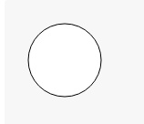

#This is yet another SVG tutorial for absolute beginners

## SVG is:
 - Scalable Vector Graphics
  - Meaning it scales to any resolution nicely and written in math terms

## SVG is not:
 - Easy to write by hand (That's why you are reading this)
 - Frightening if you take your time like any other language

##Let's just dive into it
```HTML
<svg width="100" height="100">
    <circle cx="50" cy="50" r="40" stroke="black" stroke-width="1" fill="white" />
</svg>
```
Renders to:
```SVG
<svg width="100" height="100">
    <circle cx="50" cy="50" r="40" stroke="black" stroke-width="1" fill="white" />
</svg>
```
### Wait what?
Let's just dissect this part
```HTML
<svg width="100" height="100">
    ...
</svg>
```
Alright so what we have here is ``<SVG some other stuff here>`` and ``</svg>`` 

This is how we describe that we are starting an SVG file. This is important because it lets the computer know when to start and stop thinking in terms of SVG.

This is similar to HTML in that it uses the basic syntax of ``<some-tag-here></close-with-that-same-tag-here>``

Anything that is apart of the svg tag is an option that you are setting to it so
```HTML
<svg width="100" height="100">
    ...
</svg>
```
Width and height are options to SVG that we are telling the computer to realize. We set the width and height to specify a sort of "canvas" to SVG. Telling the computer we plan to draw within the bounds of 100 pixels in width and 100 pixels in height.

Now we have this as our file
```HTML
<svg width="100" height="100">
    
</svg>
```
But it only renders to:

Well that's not very useful Let's add some commands to it

Something simple to start out with is a circle. A circle command looks like
```HTML
<circle cx="50" cy="50" r="40" stroke="black" stroke-width="1" fill="white" />
```
Let's see, so we have:
 - a new tag called circle which seems obvious
 - a cx property
 - a cy property
 - an r property
 - a stroke property
 - a stroke-width property
 - a fill property

So let's go into each one
## 'CX' Property
This is telling the computer where you want the center of the circle to be in terms of X.
### Example
```HTML
<svg width="100" height="100">
    <circle cx="22" cy="50" r="20" stroke="black">
</svg>
```
Renders to:
```SVG
<svg width="100" height="100" style="background-color:white;">
    <circle cx="22" cy="50" r="20" stroke="black">
</svg>
```

###While

```HTML
<svg width="100" height="100">
    <circle cx="78" cy="50" r="20" stroke="black">
</svg>
```
Renders to:
```SVG
<svg width="100" height="100" style="background-color:white;">
    <circle cx="78" cy="50" r="20" stroke="black">
</svg>
```

## 'CX' Property
I'm sure you can guess but.

This is telling the computer where you want the center of the circle to be in terms of Y.
### Example
```HTML
<svg width="100" height="100">
    <circle cy="22" cx="50" r="20" stroke="black">
</svg>
```
Renders to:
```SVG
<svg width="100" height="100" style="background-color:white;">
    <circle cy="22" cx="50" r="20" stroke="black">
</svg>
```

###While

```HTML
<svg width="100" height="100">
    <circle cy="78" cx="50" r="20" stroke="black">
</svg>
```
Renders to:
```SVG
<svg width="100" height="100" style="background-color:white;">
    <circle cy="78" cx="50" r="20" stroke="black">
</svg>
```

## R property

This tells the computer the radius of the circle we'd like to be drawing.

```HTML
<svg width="100" height="100">
    <circle cy="50" cx="50" r="20" stroke="black">
</svg>
```
Renders to:
```SVG
<svg width="100" height="100" style="background-color:white;">
    <circle cy="50" cx="50" r="20" stroke="black">
</svg>
```
### AND
```HTML
<svg width="100" height="100">
    <circle cy="50" cx="50" r="40" stroke="black">
</svg>
```
Renders to:
```SVG
<svg width="100" height="100" style="background-color:white;">
    <circle cy="50" cx="50" r="40" stroke="black">
</svg>
```
##Stroke Property

This tells the computer what color you'd like the outline of the shape to be.
```HTML
<svg width="100" height="100">
    <circle cy="50" cx="50" r="20" stroke="red">
</svg>
```
Renders to:
```SVG
<svg width="100" height="100" style="background-color:white;">
    <circle cy="50" cx="50" r="20" stroke="red">
</svg>
```
### OR
```HTML
<svg width="100" height="100">
    <circle cy="50" cx="50" r="20" stroke="#FF0000">
</svg>
```
Renders to:
```SVG
<svg width="100" height="100" style="background-color:white;">
    <circle cy="50" cx="50" r="20" stroke="#FF0000">
</svg>
```
> ``#FF0000`` is written in Hexadecimal which is a numbering system that can is used to represent colors as numbers. To write Hexadecimal colors you split up the numbers in pairs such as
``# FF 00 00``. Wait, FF isn't a number? What gives? Well Hexadecimal literally means numbering system of 16, we don't have numbers that go to 16 without repeating. Notice that 10 is just repeating counting as 1,2,3,4... in the ten's place. So, to get around this programmers decided to just use letters. 

>Counting goes more like this:

 Hexadecimal | Normal
 ------------|-------
0 | 0
1 | 1
2 | 2
... | ...
9 | 9
A | 10
B | 11
C | 12
D | 13
E | 14
F | 15

> But, how do you turn a number into a color? Well once it's split up like ``# FF 00 00`` We know that FF the biggest number possible in terms of a two digit Hexadecimal number. Think of it as sort of like 99 where it is 1 away from a 3 digit number. The numbers are split up like this to specify how much of one color to use in this pattern ``# (Amount of Red) (Amount of Blue) (Amount of Green)``. Therefore ``#FF0000`` is "pure red" , ``#00FF00`` is "pure blue" ,``#0000FF`` is "pure Green" ,``#000000`` is "pure black" and ``#FFFFFF`` is "pure white" a shade of gray is when all values are the same such as ``#333333`` or ``#CCCCCC``.

##Some colors
Color | Hex | Actual color
----- | --- | ------------
Light Gray | ``#CCCCCC`` | ```SVG <svg width="100" height="100" style="background-color:white;"><circle cy="50" cx="50" r="20" stroke="#FF0000"></svg>```

