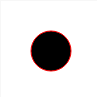
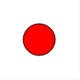

#These are properties that apply to all Elements in SVG

##Stroke Property

This tells the computer what color you'd like the outline of the shape to be.
```HTML
<svg width="100" height="100">
    <circle cy="50" cx="50" r="20" stroke="red">
</svg>
```
Renders to:


### OR
```HTML
<svg width="100" height="100">
    <circle cy="50" cx="50" r="20" stroke="#FF0000">
</svg>
```
Renders to:



 
## Stroke-Width Property
This changes the width of the outline in terms of pixels.
```HTML
<svg width="100" height="100">
    <circle cy="50" cx="50" r="20" stroke="red" stroke-width="4">
</svg>
```
Renders to:


## Fill Property
This changes the "fill" of the element basically the color of the element itself.For more information about colors go to [Colors](../colors/README.md)
```HTML
<svg width="100" height="100">
    <circle cy="50" cx="50" r="20" stroke="black" fill="red">
</svg>
```
Renders to:

