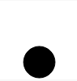
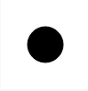

#Circles in SVG

Something simple to start out with is a circle. A circle command looks like
```HTML
<circle cx="50" cy="50" r="40" stroke="black" stroke-width="1" fill="white" />
```
Let's see, so we have:
 - a new tag called circle which seems obvious
 - [a `cx` property](#cx-property)
 - [a `cy` property](#cy-property)
 - [an `r` property](#r-property)
 - [a `stroke` property](#stroke-property)
 - [a `stroke-width` property](#stroke-width-property)
 - [a `fill` property](#fill-property)

So let's go into each one
## CX Property
This is telling the computer where you want the center of the circle to be in terms of X.
### Example
```HTML
<svg width="100" height="100">
    <circle cx="22" cy="50" r="20" stroke="black">
</svg>
```
Renders to:


###While

```HTML
<svg width="100" height="100">
    <circle cx="78" cy="50" r="20" stroke="black">
</svg>
```
Renders to:


## CY Property
I'm sure you can guess but.

This is telling the computer where you want the center of the circle to be in terms of Y.
### Example
```HTML
<svg width="100" height="100">
    <circle cy="22" cx="50" r="20" stroke="black">
</svg>
```
Renders to:


###While

```HTML
<svg width="100" height="100">
    <circle cy="78" cx="50" r="20" stroke="black">
</svg>
```
Renders to:



## R property

This tells the computer the radius of the circle we'd like to be drawing.

```HTML
<svg width="100" height="100">
    <circle cy="50" cx="50" r="20" stroke="black">
</svg>
```
Renders to:




### AND
```HTML
<svg width="100" height="100">
    <circle cy="50" cx="50" r="40" stroke="black">
</svg>
```
Renders to:


##Alright enough with those Circles!
Let's get into another shape you may be familiar with, [Rectangles](Rectangles.md).

