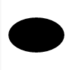

# Ellipses in SVG

Let's look at Ellipse Properties

 - [`rx` property](#rx-property)
 - [`ry` property](#ry-property)
 - [`cx` property](#cx-property)
 - [`cy` property](#cy-property)

##Basic ellipse
Looks just how you thought it would.


```SVG
<svg style="background-color:white" width=100 height=100>
  <ellipse cx="50" cy="50" rx="40" ry="25"/>
<svg>
```