#SVG tutorial for absolute beginners

##For who is this tutorial?
For people who have never seen a line of code in their life but would like to see a simple langauge used to draw stuff and have the possibility of learning animations.

## SVG is:
 - Scalable Vector Graphics
  - Meaning it scales to any resolution nicely and written in math terms
   - Don't worry it's not that much math as long as you know how to graph on an XY Plane you'll do fine.

## SVG is not:
 - Easy to write by hand (That's why you are reading this)
 - Frightening if you take your time like any other language

##Let's just dive into it
```HTML
<svg width="100" height="100">
    <circle cx="50" cy="50" r="40" stroke="black" stroke-width="1" fill="white" />
</svg>
```
Renders to:

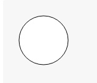
### Wait what?
Let's just dissect this part
```HTML
<svg width="100" height="100">
    ...
</svg>
```
Alright so what we have here is ``<SVG some other stuff here>`` and ``</svg>`` 

This is how we describe that we are starting an SVG file. This is important because it lets the computer know when to start and stop thinking in terms of SVG.

This is similar to HTML in that it uses the basic syntax of ``<some-tag-here></close-with-that-same-tag-here>``

Also it allows for properties on each tag in the format. ``<tag property="value"></tag>`` The "property"s are special words that are options on the tag being set to a specific value.

Anything that is apart of the SVG tag is an option that you are setting to it so
```HTML
<svg width="100" height="100">
    ...
</svg>
```
Width and height are options to SVG that we are telling the computer to realize. We set the width and height to specify a sort of "canvas" to SVG. Telling the computer we plan to draw within the bounds of 100 pixels in width and 100 pixels in height.

Now we have this as our file
```HTML
<svg width="100" height="100">
    
</svg>
```
But it only renders to:

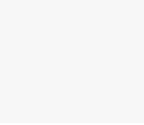

Well that's not very useful Let's add some commands to it

Something simple to start out with is a circle. A circle command looks like
```HTML
<circle cx="50" cy="50" r="40" stroke="black" stroke-width="1" fill="white" />
```
Let's see, so we have:
 - a new tag called circle which seems obvious
 - [a `cx` property](#cx-property)
 - [a `cy` property](#cy-property)
 - [an `r` property](#r-property)
 - [a `stroke` property](#stroke-property)
 - [a `stroke-width` property](#stroke-width-property)
 - [a `fill` property](#fill-property)

So let's go into each one
## 'CX' Property
This is telling the computer where you want the center of the circle to be in terms of X.
### Example
```HTML
<svg width="100" height="100">
    <circle cx="22" cy="50" r="20" stroke="black">
</svg>
```
Renders to:

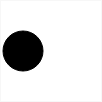

###While

```HTML
<svg width="100" height="100">
    <circle cx="78" cy="50" r="20" stroke="black">
</svg>
```
Renders to:

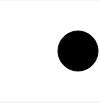

## 'CY' Property
I'm sure you can guess but.

This is telling the computer where you want the center of the circle to be in terms of Y.
### Example
```HTML
<svg width="100" height="100">
    <circle cy="22" cx="50" r="20" stroke="black">
</svg>
```
Renders to:

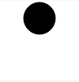

###While

```HTML
<svg width="100" height="100">
    <circle cy="78" cx="50" r="20" stroke="black">
</svg>
```
Renders to:

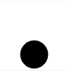

## R property

This tells the computer the radius of the circle we'd like to be drawing.

```HTML
<svg width="100" height="100">
    <circle cy="50" cx="50" r="20" stroke="black">
</svg>
```
Renders to:

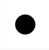


### AND
```HTML
<svg width="100" height="100">
    <circle cy="50" cx="50" r="40" stroke="black">
</svg>
```
Renders to:

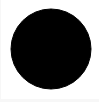

##Stroke Property

This tells the computer what color you'd like the outline of the shape to be.
```HTML
<svg width="100" height="100">
    <circle cy="50" cx="50" r="20" stroke="red">
</svg>
```
Renders to:

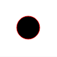

### OR
```HTML
<svg width="100" height="100">
    <circle cy="50" cx="50" r="20" stroke="#FF0000">
</svg>
```
Renders to:

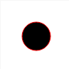

 
## Stroke-Width Property
This changes the width of the outline in terms of pixels.
```HTML
<svg width="100" height="100">
    <circle cy="50" cx="50" r="20" stroke="red" stroke-width="4">
</svg>
```
Renders to:

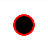

## Fill Property
This changes the "fill" of the element basically the color of the element itself.For more information about colors go to [Colors](../colors/README.md)
```HTML
<svg width="100" height="100">
    <circle cy="50" cx="50" r="20" stroke="black" fill="red">
</svg>
```
Renders to:

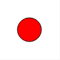

##Alright enough with those Circles!
Let's get into another shape you may be familiar with, Rectangles.

Rectangles have a pretty basic syntax:
```HTML
<rect width="75" height="30" x="10" y="15">
```
Renders to:


##Let's get into it's properties

 - [`width` property](#width-property)
 - [`height` property](#height-property)
 - [`x` property](#x-property)
 - [`y` property](#y-property)
 - [`rx` property](#rx-property)
 - [`ry` property](#ry-property)

##Width property

It changes the width of the rectangle, but I think you guessed that one.

##Height property

Guess! Guess! Guess! You won't figure this one out! Let's move on.

##X property

This changes the X coordinate of the rectangle, but let's go a little more into how this calculated. The X Axis is actually the left-most edge of the canvas. This means that the x coordinate is actually specifying the space _<b>from the left edge of the canvas</b>_ (This is important because it is not very typical)

##Y Property

This changes the Y coordinate of the rectangle and is in reference to the top of the canvas or container.

##RX Property

This refers to the radius of the circle in terms of X of the rounding of the rectangle

##RY Property

Same as [`RX` property](#rx-prorperty) but for `Y`

